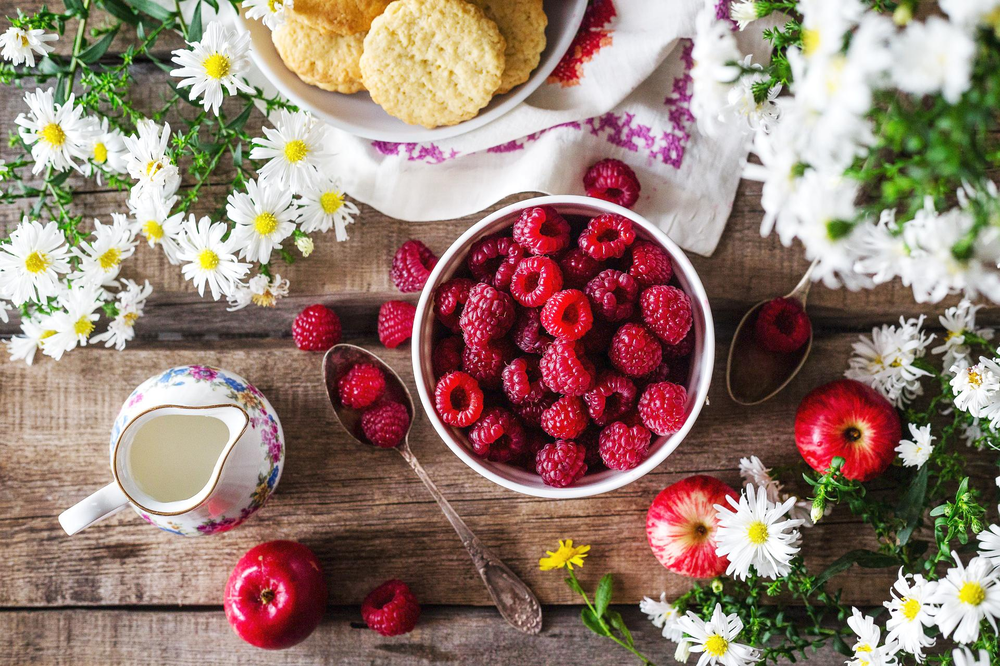
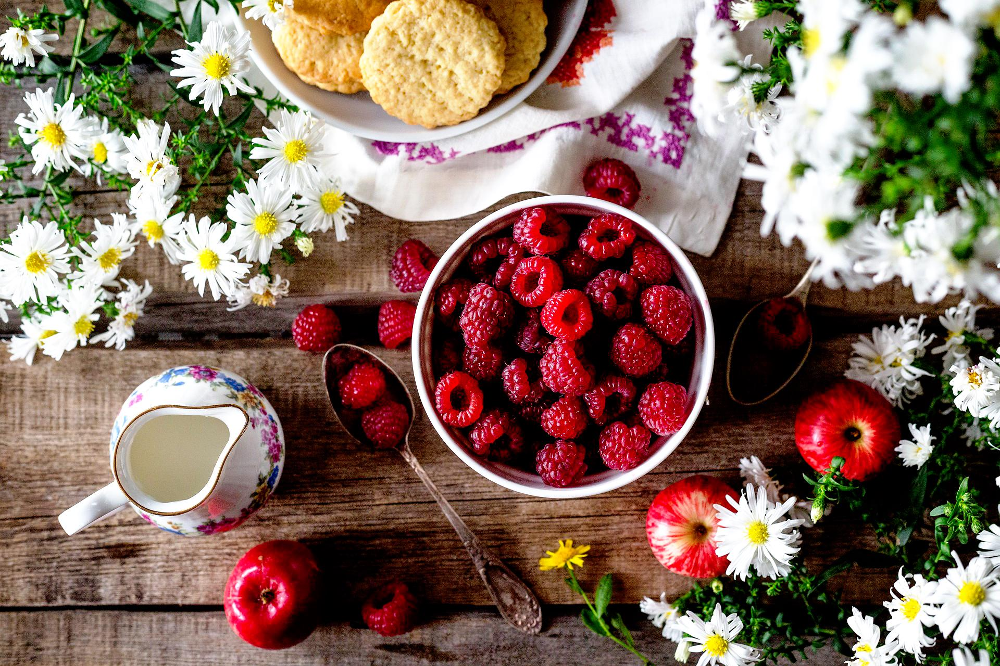
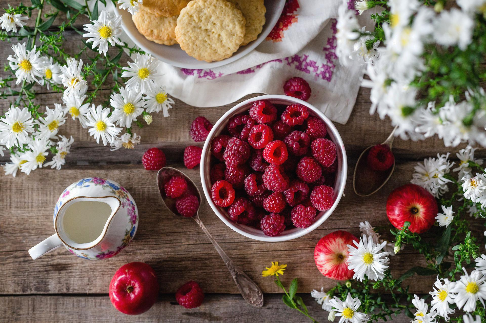
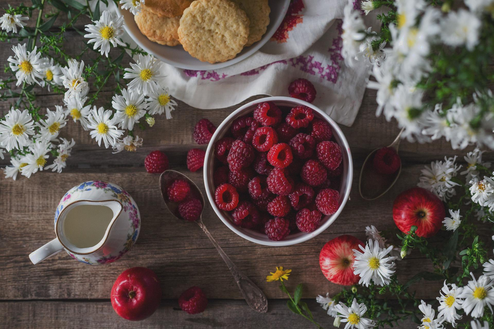
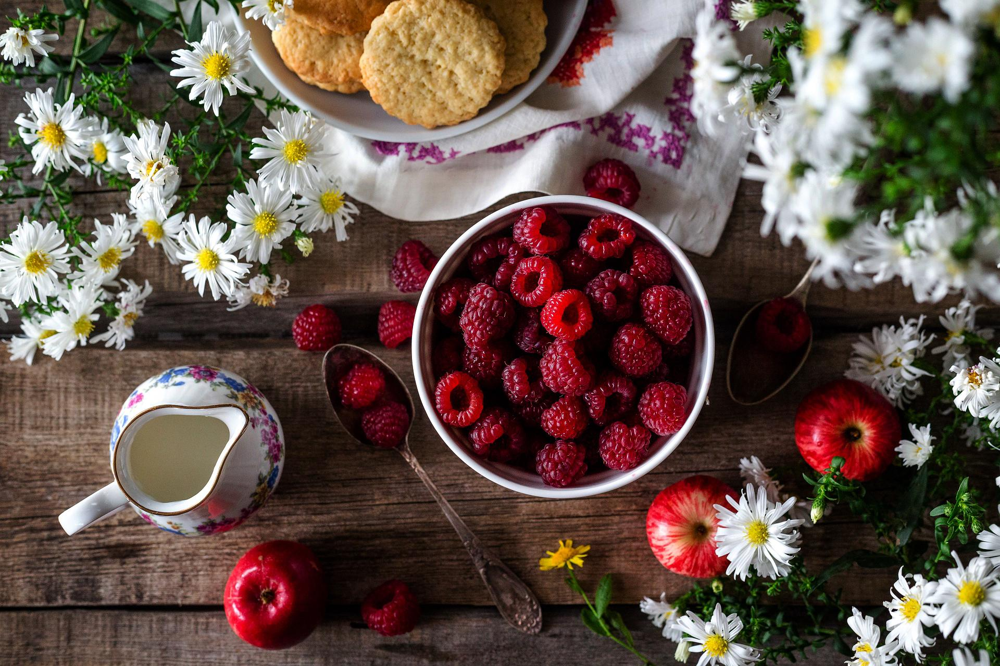
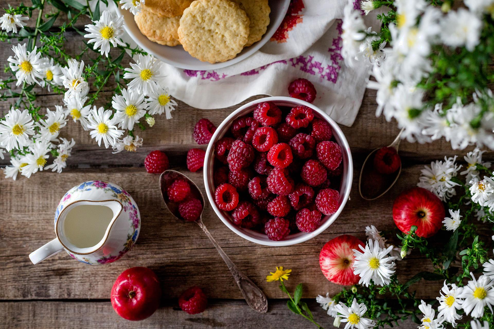
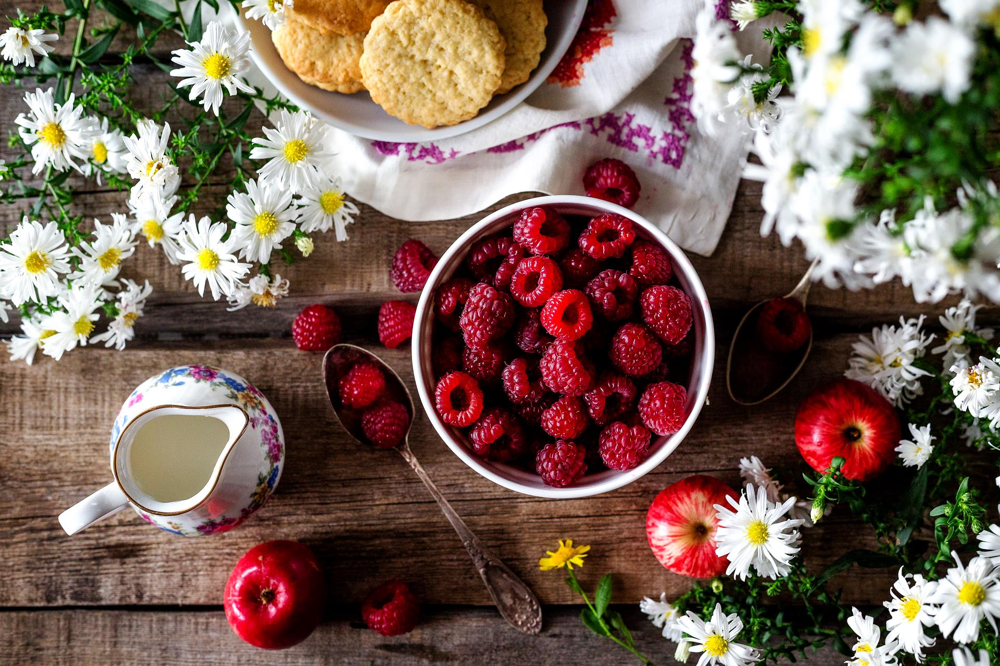
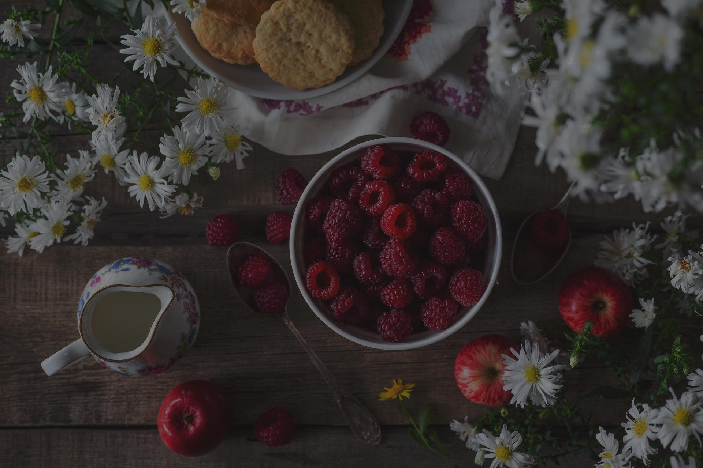
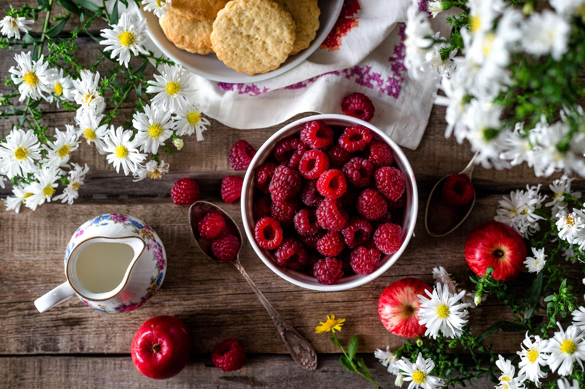

# HEYLUT
Bulk apply preset filters to image 

### Usage

    go build
    ./heylut [image]

### Filter Examples

##### Original Image:

  
|Filter|Filter|
---|---
Jadi|Lumpur
|
Suci|Silir
|
Bima|Cerah
|
Biru|Tawar
|
Kuja|Teja
|
Hari|Debu
|
Dalu|Cetus
|
Pasat|Malam
|
Alir|Bayu
|
